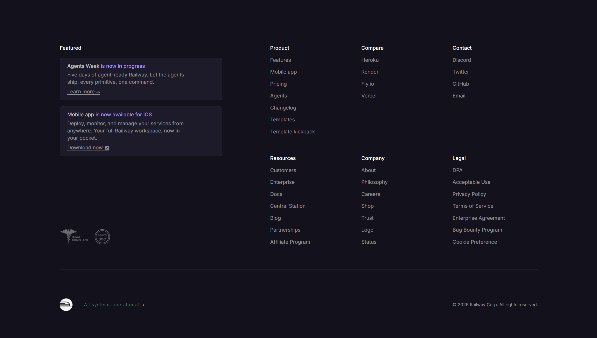

<div align="center">

# 🚀 Tailwind Footer Templates

A clean, modern, and fully responsive footer component — built with **HTML**, **CSS**, and **Tailwind CSS**.

[](https://developer.mozilla.org/en-US/docs/Web/HTML)
[](https://developer.mozilla.org/en-US/docs/Web/CSS)
[](https://tailwindcss.com/)
[](#-responsive-design)

[Live Demo](https://dipu-ray.github.io/tailwind-footer-templates/) · [GitHub](https://github.com/dipu-ray) · [LinkedIn](https://www.linkedin.com/in/dipu-ray/)

</div>

---

**Started:** 27 June, 2026  
**Last Updated:** 28 June, 2026  
**Author:** Dipu Ray

---

## 📖 Overview

**Tailwind Footer Templates** is a minimal, elegant, and fully responsive footer templates built with **HTML**, **CSS**, and **Tailwind CSS** — no frameworks beyond Tailwind CSS, no extra dependencies.

It's designed to be lightweight and easy to drop into any project. This templates is ideal for developers, designers, and marketers who want a polished, production-ready footer they can learn from, customize, or use directly — whether it's for a personal project, product showcase, or professional business site.

---

## ✨ Features

- 🎨 **Modern, minimal UI** with a clean visual hierarchy and flexible Tailwind utilities
- 🔗 **Well-structured footer layout** — branding, navigation links, social icons, and copyright section
- 📱 **Fully responsive** — built with a mobile-first approach that scales perfectly to tablet and desktop
- ⚡ **HTML, CSS & Tailwind CSS** — no JavaScript frameworks or external libraries required
- 🧩 **Semantic HTML structure** for optimal web accessibility and SEO performance
- 🪶 **Lightweight & fast** — single-file utility structure without mandatory build tools or dependencies
- 🛠️ **Easy to customize** — rapidly change themes, spacing, colors, and typography using inline classes
- 🌐 **Cross-browser compatible**

---

## 🖼️ Preview

<div align="center">
  
</div>

---

## 🗂️ Project Structure

```
tailwind-footer-templates/
├── assets/                 # Static files
│   └── logo/               # Logo's
│   └── project-demo/       # Project preview
├── README.md               # Project documentation
├── index.html              # HTML + Tailwind CSS
└── style.css               # Custom CSS styles
```

---

## 🛠️ Built With

- **HTML5** — Semantic page structure
- **CSS3** — Layout and custom styling
- **Tailwind CSS** — Utility classes, arbitrary values, flex/grid utilities, responsive modifiers

---

<div align="center">

If you found this project helpful, please consider giving it a ⭐ — it helps a lot!

</div>
